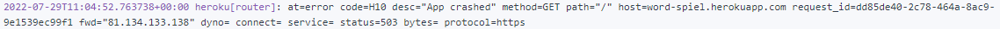
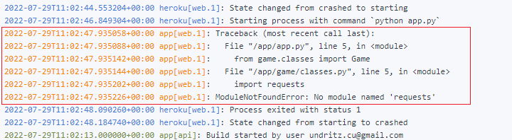
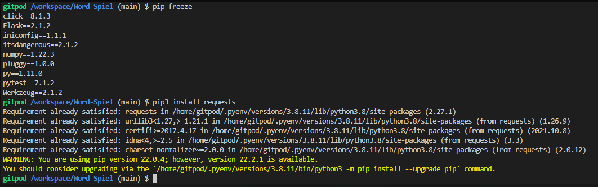

# Word Spiel (Word Play) - Readme document

<!-- 

  

 -->

<!-- ### Website can be viewed here: https://c-undritz.github.io/Pattern-Spiel/
### Project GitHub site: https://github.com/C-Undritz/Pattern-Spiel -->

### **Disclaimer: This Website is for educational purposes only.**

---
# Table of Contents
* [OVERVIEW](#overview)
* [FEATURES](#features)
* [TECHNOLOGIES USED](#technologies-used)
* [DEVELOPMENT](#development)
* [FURTHER DEVELOPMENT](#further-development)

---
># **OVERVIEW**
This is a Wordle clone through and through!  I have never actually played Wordle but after learning about the game I was telling everyone that the game would be simple to code so I thought I had better put my money where my mouth is!  This project uses HTML5, CSS and JavaScript to power a responsive web front-end and Flask to power the back end with the game logic written in Python.  Two API's are also used.  

Like actual Wordle, the player is asked to guess a word by typing in a word and the game returns hints against the guess to guide the player to the word to guess.  As long as the player guesses the word within the set number of rounds then they win the game!

 

># **TECHNOLOGIES USED**

## Languages
* HTML5
* CSS3
* JavaScript 
* Python

## Libraries & Frameworks
* [Flask web application framework](https://flask.palletsprojects.com/en/2.0.x/)
* [Jinja template engine for Python](https://jinja.palletsprojects.com/en/3.0.x/)
* Werkzeug [WSGI](https://wsgi.readthedocs.io/en/latest/) web application library
* [Pytest](https://docs.pytest.org/en/7.1.x/)
* [Requests](https://pypi.org/project/requests/)
* [Google Fonts](https://fonts.google.com/)

## Tools
* [Gitpod](https://www.gitpod.io/) - chosen IDE for this project.
* [GitHub](https://github.com) - for storage and sharing of code remotely.
* [Heroku](https://www.heroku.com/) - Hosting provider for app.
* [Balsamiq](https://balsamiq.com/) - to create wireframes.
* [favicon](https://favicon.io/) - for generating 32x32 favicon.
* [Am I responsive](http://ami.responsivedesign.is/) - to create the responsive illustrations featured in the TESTING.md.

## APIs
Used [rapidapi.com](https://rapidapi.com/hub) to access the APIs used below:

- [WordsAPI](https://rapidapi.com/dpventures/api/wordsapi/): Used to check the validity of the word entered by the player.
- [Random Words](https://rapidapi.com/sheharyar566/api/random-words5/): Used to generate a new word each game.

># **ISSUES & FIXES**
- An instance of the Game class is instantiated at the top of the app.py file so that it is accessible to all functions within that file.  However because of this it was not initially known how to recreate this class as required between rounds or should the user quit a game and then restart.  This was solved by adding a 'reset' method to the Game class as suggested in the stackover post [here](https://stackoverflow.com/questions/45798899/preferred-way-of-resetting-a-class-in-python).  This method can then be called at any point as required to wipe the current data from the class for a new game to be started.
- The initial deployment to Heroku resulted in an H10 error:
  
Investigating the heroku logs, the error below was displayed:  
  
Within the IDE terminal it was determined that whilst the 'requests' module was installed, it was not showing up on the pip freeze command:  
  
Therefore to fix it 'requests == 2.27.1' was manually added to the requirements.txt file and then redeployed to heroku.  Thanks to jo_ci for help with this!

># **REFERENCES**
- CSS background adapted from codepen by [TokyoWeb](https://codepen.io/tokyoweb/pen/ZjdYVj)
- Bespoke modal was created using the [w3schools guide](https://www.w3schools.com/howto/howto_css_modals.asp) 
- Guide on how to split a dictionary into keys and values and used in the hints_list game class method was referenced from [stackoverflow](https://stackoverflow.com/questions/41330311/split-dictionary-depending-on-key-lists)

># **CREDIT & THANKS**
# Code
- [How to share global variables between files in Python](https://instructobit.com/tutorial/108/How-to-share-global-variables-between-files-in-Python)
- [How to reset a class](https://stackoverflow.com/questions/45798899/preferred-way-of-resetting-a-class-in-python)
- [How to count the number of elements in a parent](https://www.geeksforgeeks.org/html-dom-childelementcount-property/)

